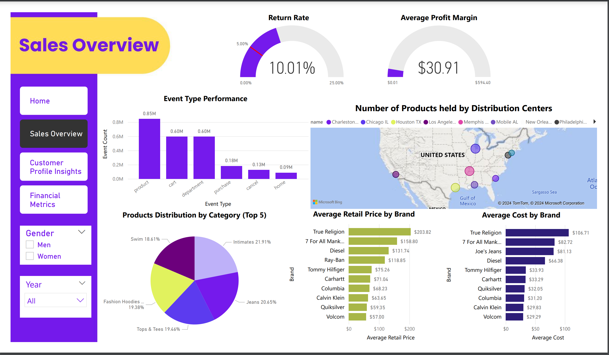
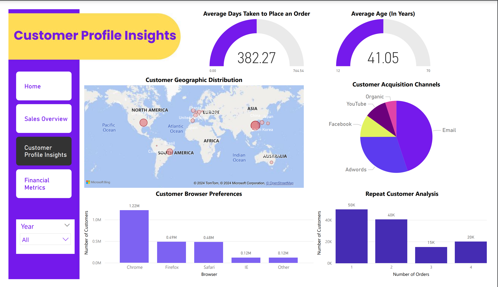
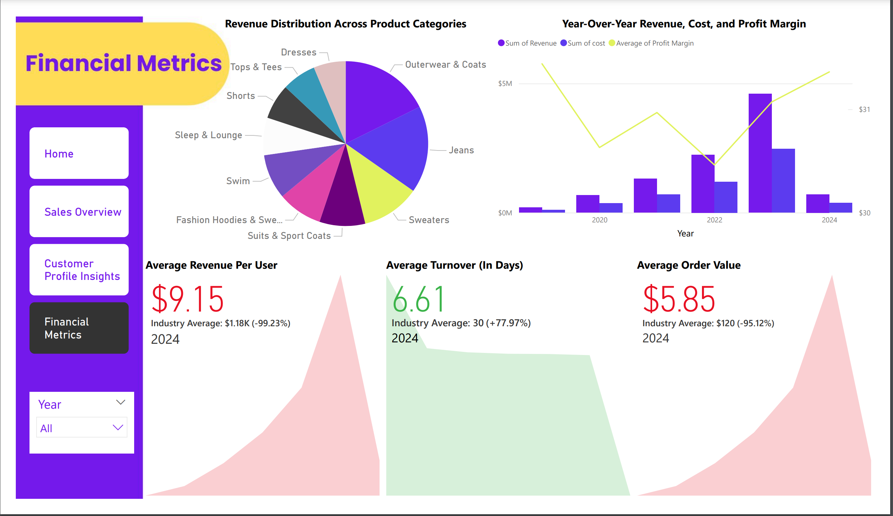

# 🌟 **The Look E-Commerce Dashboard Analysis**

## 🚀 **Overview**
This project brings to life an **interactive Power BI dashboard** analyzing the **Look E-Commerce** dataset hosted on **Google BigQuery**. By simulating real-world e-commerce operations, this dashboard uncovers **key trends and insights** in customer behavior, sales performance, and financial metrics.

### 🎯 **Key Challenges Addressed**
- Low **customer retention**.
- Rising **customer acquisition costs**.
- Declining **year-over-year revenue growth**.

---

## 📊 **Key Features**
- **Sales Overview**: Track sales trends, return rates, and brand performance.
- **Customer Demographics**: Understand customer profiles, including age, location, and purchasing patterns.
- **Financial Metrics**: Dive into revenue drivers, average order value (AOV), and inventory turnover efficiency.

---

## 📂 **Dataset Description**
The **Look E-Commerce** dataset comprises several structured tables for comprehensive analysis:

### **Fact Tables**:
- `distribution_centers`
- `orders`
- `events`

### **Dimension Tables**:
- `inventory_items`
- `order_items`
- `products`
- `users`

This synthetic dataset provides a 360° view of customer interactions, product inventory, and order logistics.

---

## 🖥️ **Dashboard Structure**

### **1. Sales Overview**
- Analyze return rates (10% vs. 15.2% industry average).
- Discover high-margin brands like **Ray-Ban** and **Canada Goose**.
- Explore product category trends, with **Intimates** leading sales.

---

### **2. Customer Demographics**
- Average customer age: **41 years** (above the 18–24 industry norm).
- Top markets: **China** and the **United States**.
- Key challenges:
  - **382 days** between orders.
  - Low repeat purchase rates and reliance on paid channels.

---

### **3. Financial Metrics**
- Revenue drivers: Outerwear, coats, and jeans.
- Industry benchmarks:
  - **ARPU**: $9.15 vs. $1,180.
  - **AOV**: $5.85 vs. $120.
- Efficient inventory turnover: **7 days** vs. 30-day average.

---

## 🔑 **Key Insights**
- 💡 Efficient inventory management with a fast turnover cycle.
- 📉 Challenges in customer retention, ARPU, and checkout experience.
- 💰 High profitability from brands like Ray-Ban and Canada Goose.
- 🛒 Significant cart abandonment issues, suggesting a need to streamline the checkout process.

---

## 📌 **Recommendations**
### 1️⃣ **Enhance Customer Retention**  
- Introduce **loyalty programs**, exclusive discounts, and early product access.

### 2️⃣ **Target Younger Audiences**  
- Launch trendy products or a sub-brand catering to the 18–24 demographic.

### 3️⃣ **Streamline Checkout**  
- Offer **guest checkout**, multiple payment options, and transparent costs.

### 4️⃣ **Boost Organic Traffic**  
- Invest in **SEO** and **content marketing** through blogs, videos, and social media.

### 5️⃣ **Diversify Product Portfolio**  
- Add mid- and low-priced products for broader appeal.

---

## 🔮 **Future Work**
- 🧠 **Machine Learning Applications**:
  - Customer segmentation for targeted marketing.
  - Predictive inventory management.
  - Sales forecasting and demand planning.
- 💬 **NLP Insights**:
  - Use customer feedback for deeper insights into preferences and sentiment.

---

## 🛠️ **Tools Used**
- **Power BI**: Interactive dashboards and data visualization.
- **Google BigQuery**: Hosting and querying large datasets.
- **Power Query**: Data cleaning and transformation.

---

## 🌟 **Project Outcomes**
This dashboard empowers **The Look** to:
- Increase customer satisfaction.  
- Enhance profitability.  
- Maintain a competitive edge in the e-commerce landscape.
